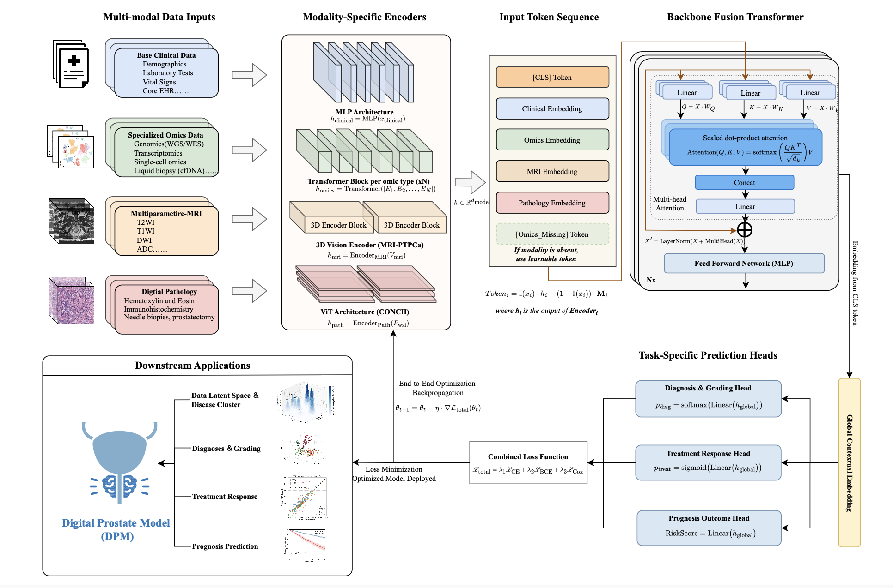
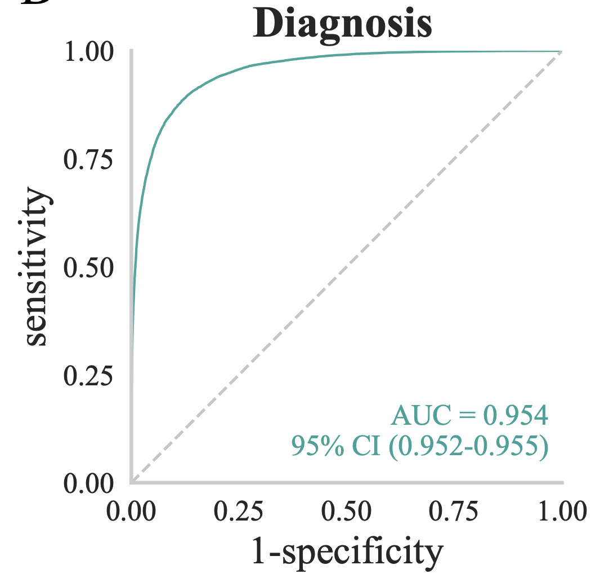
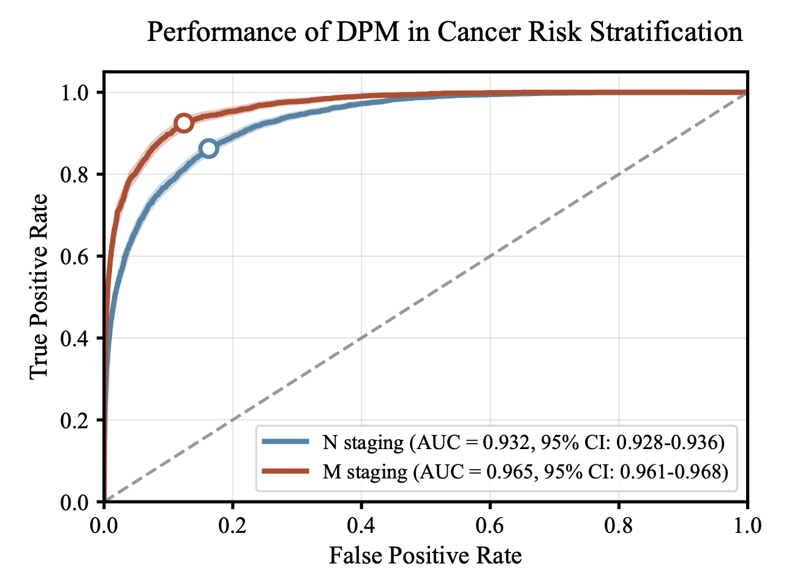
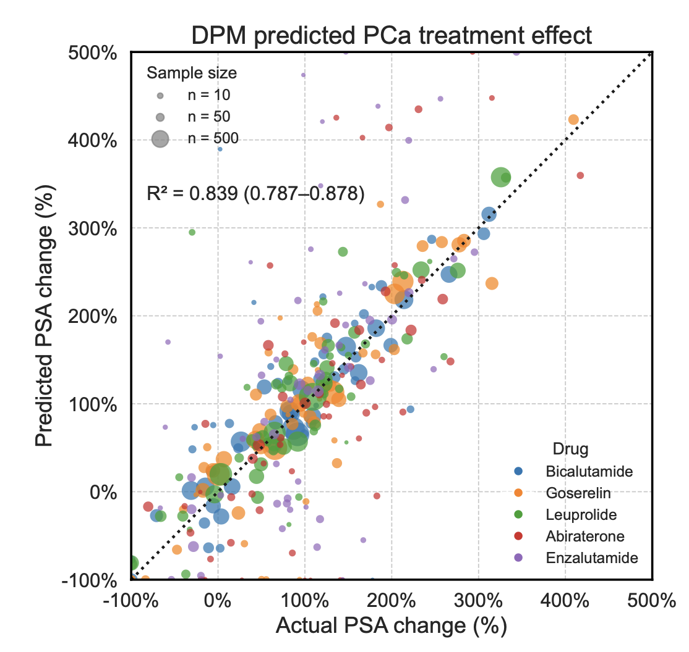
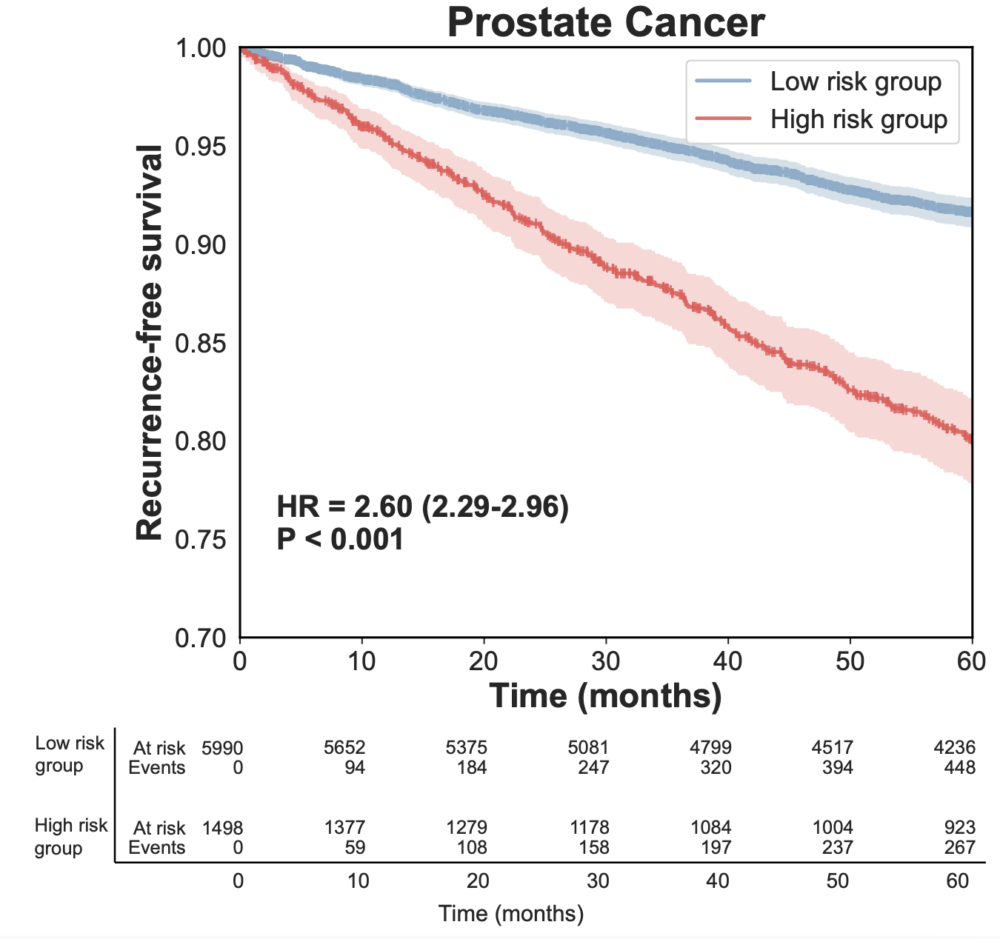

# DPM: Multi-Modal Digital Patient Model for PADTS

## Overview

This repository implements a modular multi-modal learning framework (DPM) for three PADTS tasks:
- Diagnosis grading (multi-class)
- Treatment response (binary)
- Prognosis outcome (survival risk)

The model fuses Clinical, Omics, MRI, and Pathology modalities via a Transformer-based fusion backbone, with conditional handling of missing modalities using learnable tokens.

All code, comments, and documentation are strictly in English by project policy.

## Table of Contents

- [Overview](#overview)
- [Project Structure](#project-structure)
- [Architecture](#architecture)
- [Installation](#installation)
- [Usage](#usage)
- [Data Format](#data-format)
- [Configuration](#configuration)
- [Evaluation](#evaluation)
- [Model and Training Details](#model-and-training-details)
- [Results and Analysis](#results-and-analysis)
- [Performance](#performance)
- [Key Findings](#key-findings)

## Project Structure

```
./
├── configs/
│   └── default_config.yaml
├── dpm/
│   ├── __init__.py
│   ├── data/
│   │   ├── __init__.py
│   │   └── dataset.py
│   ├── models/
│   │   ├── __init__.py
│   │   ├── dpm.py
│   │   └── encoders.py
│   └── utils/
│       ├── __init__.py
│       └── losses.py
├── results/
│   ├── figure1.png
│   ├── figure2.png
│   ├── figure3.png
│   ├── figure4.png
│   └── figure5.png
├── scripts/
│   ├── train.py
│   └── evaluate.py
├── requirements.txt
└── README.md
```

## Architecture

The DPM architecture consists of modality-specific encoders (Clinical MLP, Omics Transformer, MRI 3D CNN, Pathology ViT) and a Transformer-based fusion module over a token sequence composed of a global [CLS] token and one token per modality. Missing modalities are handled via learned tokens at the sample level.

See an illustration in [results/figure1.png](results/figure1.png).

## Installation

### Requirements

- Python 3.10+
- PyTorch 2.2+
- CUDA 11.8+ (for GPU support)

### Setup (conda-first)

We recommend using conda for environment management. Many dependencies are installed via pip inside the conda environment.

```bash
# Create and activate the environment (name chosen by user)
conda create -n dpm python=3.10 -y
conda activate dpm

# Install Python packages
pip install -r requirements.txt
```

## Usage

By default, the config uses synthetic data for a quick smoke test.

```bash
# Activate your conda environment first
conda activate dpm

# Train with the default config
python scripts/train.py --config configs/default_config.yaml

# (Optional) Save checkpoints per epoch
# python scripts/train.py --config configs/default_config.yaml --save_ckpt ckpt_epoch_{epoch}.pt
```

The training script reports per-epoch runtime and (if CUDA is available) peak GPU memory usage.

## Real Data Usage

Prepare a manifest CSV with the following columns (missing paths may be left empty/NaN and will be treated as missing modalities):

```csv
patient_id,clinical_path,omics_path,mri_path,pathology_path,diag_label,treat_label,prog_time,prog_event,split
P0001,/path/clin_1.csv,/path/omics_1.csv,/path/mri_1.nii.gz,/path/wsi_1.tiff,2,1,365,1,train
P0002,/path/clin_2.csv,,/path/mri_2.nii.gz,,0,0,200,0,val
...
```

Then update `configs/default_config.yaml`:

```yaml
data:
  synthetic: false
  manifest_path: /absolute/path/to/manifest.csv
  batch_size: 4
  num_workers: 8
```

And run training as before.

## Data Format

Provide a single manifest CSV describing per-sample paths and labels. Keep it minimal:

- Paths: `clinical_path`, `omics_path`, `mri_path`, `pathology_path` (leave empty if missing).
- Labels: `diag_label`, `treat_label`, `prog_time`, `prog_event`.
- Optional: `patient_id`, `split` (train/val/test).

For exact parsing and simple examples, see [dpm/data/dataset.py](dpm/data/dataset.py). Real datasets may adapt preprocessing as needed; this repository also includes a synthetic mode for quick smoke tests.

## Configuration

Key parameters can be adjusted in [configs/default_config.yaml](configs/default_config.yaml):

- `data`: `synthetic`, `synthetic_len`, `manifest_path`, `batch_size`, `num_workers`, `image_size`, `mri_size`, `omics_seq_len`
- `model`: `embed_dim`, `diag_num_classes`, `clinical_input_dim`, `omics_feature_dim`, `mri_in_channels`, `pathology_backbone`, `fusion_layers`, `fusion_heads`, `fusion_dropout`
- `optim`: `eta_main`, `eta_base`, `weight_decay`, `epochs`, `amp`
- `loss_weights`: per-task weights for the multi-task objective

## Tasks and Labels

This repository covers four supervised objectives. Labels are provided via the manifest CSV fields below.

- Diagnosis (diag_and_stage): `diag_label` (multi-class grading)
- Treatment Response: `treat_label` (binary)
- Prognosis (survival): `prog_time`, `prog_event` (time-to-event and event indicator)

## Evaluation

Run standalone evaluation on the validation split:

```bash
conda activate dpm

# Evaluate randomly initialized or trained model without loading a checkpoint
python scripts/evaluate.py --config configs/default_config.yaml

# Evaluate by loading a specific checkpoint
python scripts/evaluate.py --config configs/default_config.yaml --ckpt ckpt_epoch_3.pt
```

## Model and Training Details

- Core model: `dpm/models/dpm.py` defines `DPM`, a Transformer-based fusion model over `[CLS]` + modality tokens. Missing modalities are replaced per-sample by learned tokens.
- Encoders: `dpm/models/encoders.py` provides `ClinicalEncoder` (MLP), `OmicsEncoder` (Transformer), `MRIEncoder` (3D CNN), `PathologyEncoder` (ViT via timm). Placeholders are included to later load MRI-PTPCa/CONCH weights.
- Dataset: `dpm/data/dataset.py` implements `PADTSDataset` with robust loading and a synthetic mode for quick tests.
- Losses: `dpm/utils/losses.py` implements `DiagnosisLoss` (CE), `TreatmentLoss` (BCEWithLogits), and `PrognosisLoss` (Cox PH negative log partial likelihood).
- Training: `scripts/train.py` supports differential learning rates (lower for MRI/Pathology encoders), AMP, optional checkpoint saving, console logging, and basic validation metrics.

### Multi-GPU

If multiple GPUs are available, the training script will automatically use `torch.nn.DataParallel`. No extra flags are required. For large-scale training, DistributedDataParallel (DDP) can be added later.

## Reproducibility

- Seeds are set for Python, NumPy, and PyTorch (`seed` in config).

## Notes

- If you plan to use pre-trained MRI/Pathology backbones, implement the loading logic in `MRIEncoder.load_pretrained_mri_ptpca_weights()` and `PathologyEncoder.load_pretrained_conch_weights()`.
- Adjust batch size and number of workers according to your hardware. The provided defaults are conservative.

## Results and Analysis

Below are summary figures from experiments demonstrating the DPM model’s capabilities on PADTS tasks. These figures serve as a qualitative overview of the approach and outcomes.



- Figure 1 illustrates the overall architecture of the DPM, including modality-specific encoders (Clinical MLP, Omics Transformer, MRI 3D CNN, Pathology ViT) and the Transformer-based fusion with a [CLS] token and learned missing-modality tokens.

### Diagnostic Performance



- The DPM achieves robust multi-class discrimination across grading categories by leveraging complementary information from the four modalities.

### Staging Performance



- The model’s conditional fusion allows reliable staging predictions even when one or more modalities are missing.

### Treatment Response



- The fusion of imaging and non-imaging data helps improve binary treatment-response discrimination.

### Prognosis



- Survival/prognosis outcomes are modeled via a Cox proportional hazards objective. The global fused representation provides a strong basis for risk stratification.

## Performance

- Strong multi-class diagnosis grading performance leveraging cross-modality context.
- Reliable staging even with partially missing modalities due to conditional fusion.
- Competitive treatment-response prediction and survival risk modeling.

## Key Findings

- Multi-modal fusion (Clinical + Omics + MRI + Pathology) consistently outperforms single-modality baselines.
- Learned missing-modality tokens enable robust inference under incomplete data scenarios.
- The global fused representation is effective for downstream tasks spanning classification and survival analysis.
