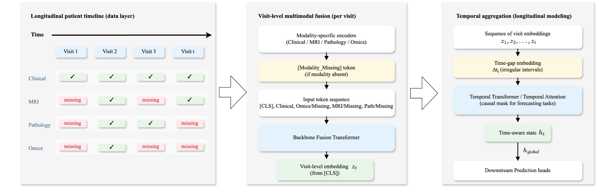
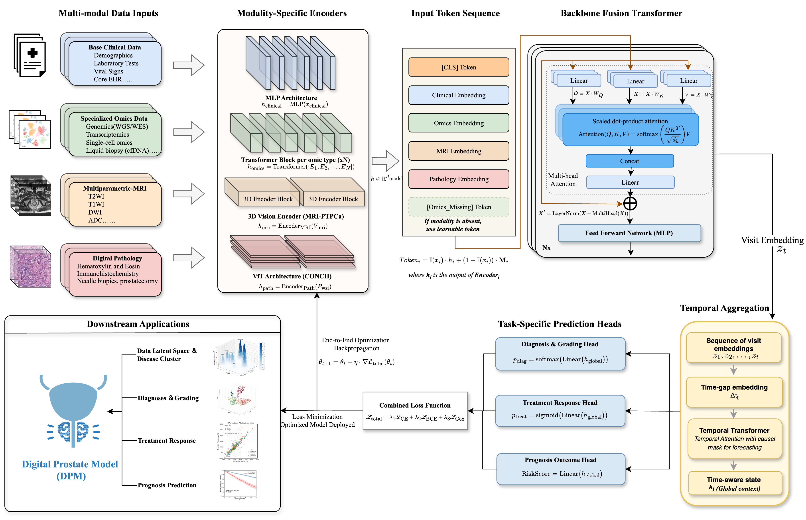
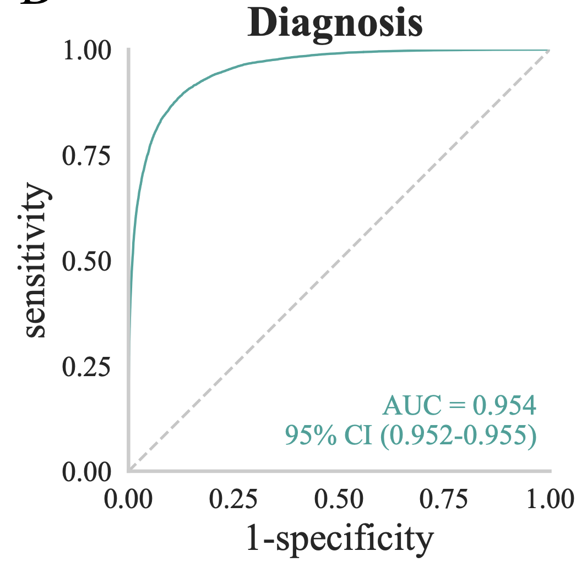
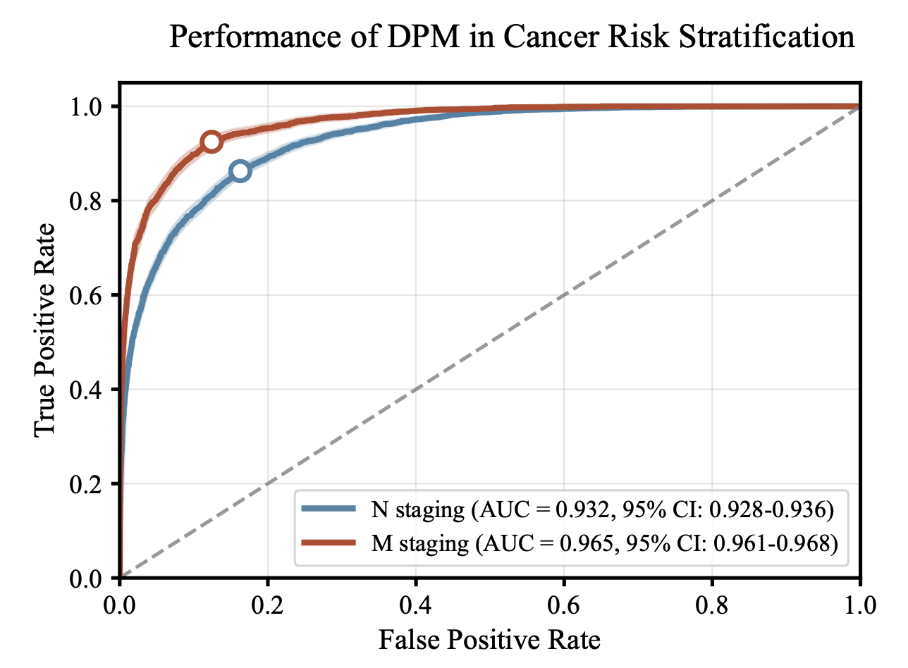
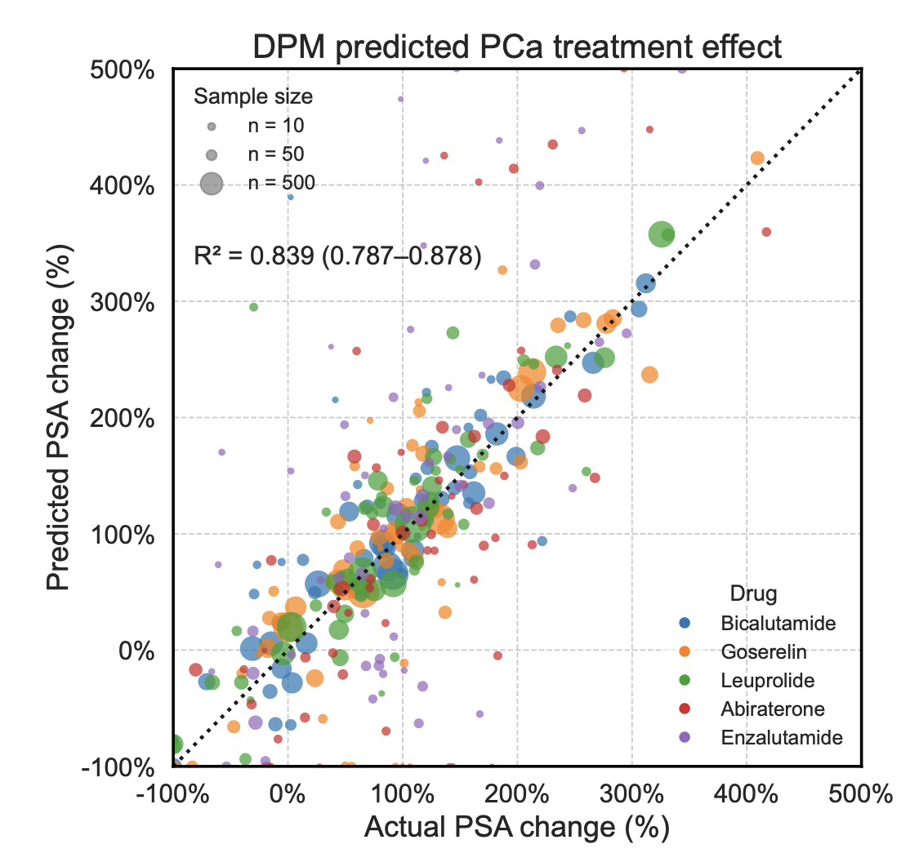
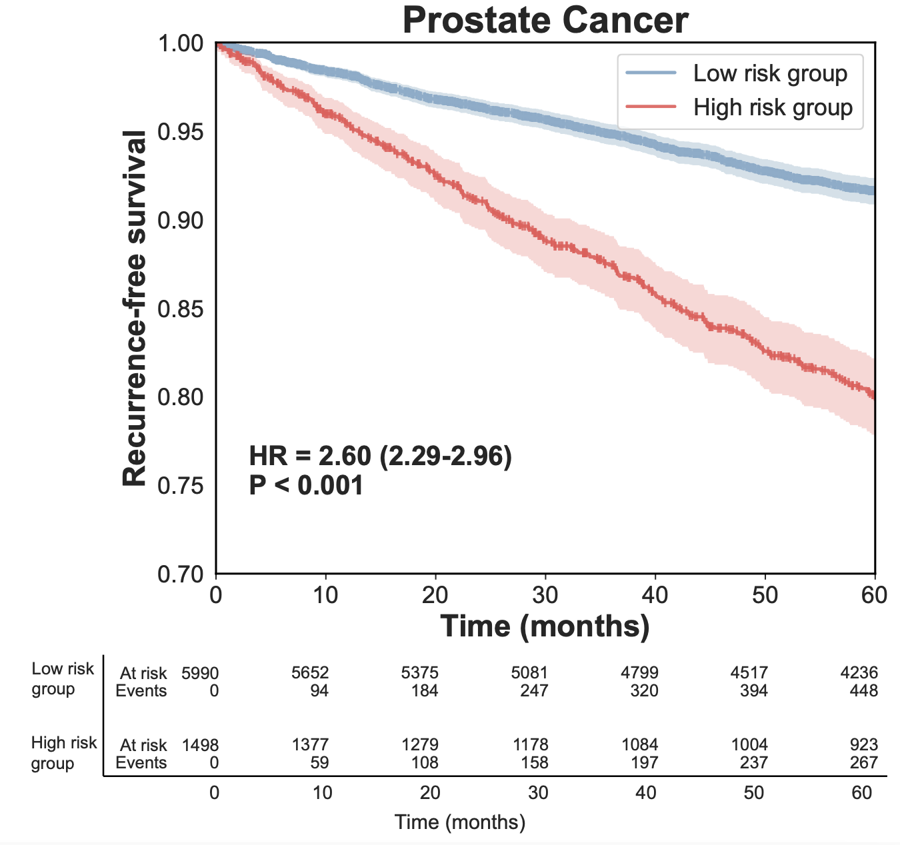

# DPM: Digital Prostate Model

A Multi-Modal Temporal Fusion Framework for Prostate Disease Analysis

## Overview

This repository implements the **Digital Prostate Model (DPM)**, a deep learning framework for comprehensive prostate disease analysis. The model performs multiple clinical tasks:

- **Diagnosis**: 8-class prostate disease classification (Normal, BPH, Prostatitis, PCa Grade Groups 1-5)
- **Staging**: ISUP grading, IPSS scoring, NIH-CPSI classification
- **Treatment Response**: Multi-label treatment outcome prediction
- **Prognosis**: Survival risk prediction using Cox proportional hazards

The model fuses four data modalities (Clinical, Omics, MRI, Pathology) via a Transformer-based fusion backbone with temporal modeling for longitudinal patient visits. Missing modalities are handled via learnable tokens.

## Table of Contents

- [Overview](#overview)
- [Project Structure](#project-structure)
- [Architecture](#architecture)
- [Sample Data](#sample-data)
- [Installation](#installation)
- [Usage](#usage)
- [Evaluation](#evaluation)
- [Model and Training Details](#model-and-training-details)
- [Missing Modality Handling](#missing-modality-handling)
- [Pre-trained Weights](#pre-trained-weights-optional)
- [Results and Analysis](#results-and-analysis)

## Project Structure

```
./
├── configs/
│   └── default_config.yaml      # Model and training configuration
├── dpm/
│   ├── __init__.py
│   ├── data/
│   │   ├── __init__.py
│   │   ├── dataset.py           # Multi-modal patient dataset
│   │   └── collate.py           # Batch collation for variable-length visits
│   ├── models/
│   │   ├── __init__.py
│   │   ├── dpm.py               # Main DPM fusion model
│   │   ├── encoders.py          # Modality-specific encoders
│   │   └── temporal.py          # Temporal modeling components
│   ├── preprocessing/           # Data preprocessing reference implementations
│   │   ├── __init__.py
│   │   ├── README.md            # Preprocessing documentation
│   │   ├── tabular.py           # Clinical/lab feature preprocessing
│   │   ├── mri.py               # MRI volume preprocessing
│   │   ├── pathology.py         # WSI preprocessing
│   │   └── omics.py             # Genomic/proteomic preprocessing
│   └── utils/
│       ├── __init__.py
│       └── losses.py            # Multi-task loss functions
├── data/
│   └── sample/                  # Sample data for testing
├── results/
│   └── figure*.png              # Experimental results figures
├── scripts/
│   ├── train.py                 # Training script
│   └── evaluate.py              # Evaluation with comprehensive metrics
├── setup.py                     # Package installation
├── requirements.txt
└── README.md
```

## Architecture

The DPM architecture consists of:

1. **Modality-Specific Encoders**:
   - Clinical MLP: Processes tabular clinical/lab features
   - Omics Transformer: Encodes genomic/proteomic sequences
   - MRI 3D CNN: Extracts features from volumetric imaging
   - Pathology ViT: Processes histopathology images

2. **Temporal Modeling**:
   - Sinusoidal time gap embeddings for irregular visit intervals
   - Causal Transformer for longitudinal sequence modeling

3. **Multi-Modal Fusion**:
   - Transformer-based fusion with [CLS] token and modality tokens
   - Learnable tokens for missing modality handling

4. **Multi-Task Prediction Heads**:
   - Diagnosis, Staging, Treatment Response, and Prognosis

See the architecture illustration in [results/figure1.png](results/figure1.png).

## Sample Data

The repository includes synthetic sample data in `data/sample/` for testing and development.

### Directory Structure

```
data/sample/
├── manifest.csv           # Main metadata file
├── clinical/              # Clinical feature vectors
│   ├── P00001_V001.npy    # Patient 1, Visit 1
│   ├── P00001_V002.npy    # Patient 1, Visit 2
│   └── ...
├── mri/                   # MRI volume features (sparse)
│   ├── P00001_V002.npy
│   └── ...
├── pathology/             # Pathology image features (sparse)
│   ├── P00002_V002.npy
│   └── ...
└── omics/                 # Omics sequence features (sparse)
    ├── P00004_V003.npy
    └── ...
```

## Installation

### Requirements

- Python 3.10+
- PyTorch 2.2+
- CUDA 11.8+ (for GPU support)

### Setup (conda-first)

We recommend using conda for environment management. Many dependencies are installed via pip inside the conda environment.

```bash
# Create and activate the environment (name chosen by user)
conda create -n dpm python=3.10 -y
conda activate dpm

# Install Python packages
pip install -r requirements.txt
```

## Usage

By default, the config uses synthetic data for a quick smoke test.

```bash
# Activate your conda environment first
conda activate dpm

# Train with the default config
python scripts/train.py --config configs/default_config.yaml

# (Optional) Save checkpoints per epoch
# python scripts/train.py --config configs/default_config.yaml --save_ckpt ckpt_epoch_{epoch}.pt
```

The training script reports per-epoch runtime and (if CUDA is available) peak GPU memory usage.

## Evaluation

The evaluation script computes comprehensive metrics for all tasks:

| Task Type | Metrics |
|-----------|---------|
| Classification | Accuracy, AUROC, AUPRC, ECE, Brier Score |
| Multi-label | AUROC, AUPRC, Brier Score |
| Survival | C-index (Concordance Index) |

Run evaluation:

```bash
conda activate dpm

# Evaluate on validation set
python scripts/evaluate.py --config configs/default_config.yaml --mode val

# Evaluate on test set with checkpoint
python scripts/evaluate.py --config configs/default_config.yaml --ckpt model.pt --mode test
```

Output includes detailed tables for Diagnosis, Staging, Treatment, and Prognosis metrics.

## Model and Training Details

- **Core Model**: `dpm/models/dpm.py` - Transformer-based multi-modal fusion with temporal modeling
- **Temporal Module**: `dpm/models/temporal.py` - Sinusoidal time gap embeddings and causal Transformer
- **Encoders**: `dpm/models/encoders.py` - ClinicalEncoder (MLP), OmicsEncoder (Transformer), MRIEncoder (3D CNN), PathologyEncoder (ViT)
- **Dataset**: `dpm/data/dataset.py` - Patient-level dataset with longitudinal visits and missing modality handling
- **Losses**: `dpm/utils/losses.py` - DiagnosisLoss, StagingLoss, TreatmentLoss, PrognosisLoss (Cox PH)
- **Training**: `scripts/train.py` - Differential learning rates, AMP support, checkpoint saving

### Multi-GPU

If multiple GPUs are available, the training script will automatically use `torch.nn.DataParallel`. No extra flags are required. For large-scale training, DistributedDataParallel (DDP) can be added later.

## Missing Modality Handling

Real-world clinical data often has missing modalities due to varying diagnostic protocols across visits. The DPM model handles this through **learnable missing-modality tokens**.



### Three-Stage Pipeline

1. **Longitudinal Patient Timeline (Data Layer)**
   - Patients have multiple visits over time (V001, V002, ..., Vt)
   - Each visit may have different available modalities
   - Missing modalities are marked in the manifest CSV with empty paths

2. **Visit-Level Multimodal Fusion (Per Visit)**
   - Available modalities are encoded by modality-specific encoders
   - **Missing modalities are replaced with learnable `[Modality_Missing]` tokens**
   - Input token sequence: `[CLS], Clinical, Omics/Missing, MRI/Missing, Path/Missing`
   - Backbone Fusion Transformer produces visit embedding z_t from [CLS] token

3. **Temporal Aggregation (Longitudinal Modeling)**
   - Sequence of visit embeddings: z_1, z_2, ..., z_t
   - Time-gap embedding handles irregular visit intervals (Δt)
   - Temporal Transformer with causal mask aggregates into h_global
   - Downstream prediction heads output task-specific predictions

### Implementation Details

```python
# Missing modality tokens (learnable parameters)
self.clinical_missing_token = nn.Parameter(torch.randn(1, 1, E) * 0.02)
self.omics_missing_token = nn.Parameter(torch.randn(1, 1, E) * 0.02)
self.mri_missing_token = nn.Parameter(torch.randn(1, 1, E) * 0.02)
self.pathology_missing_token = nn.Parameter(torch.randn(1, 1, E) * 0.02)
```

When a modality is absent, the corresponding missing token is used instead of the encoder output, allowing the model to learn meaningful representations even with incomplete data.

## Reproducibility

- Seeds are set for Python, NumPy, and PyTorch (`seed` in config).

## Pre-trained Weights (Optional)

The DPM model supports optional pre-trained weights for the MRI and Pathology encoders. These foundation models can significantly improve performance but are **not required** for code execution.

### Supported Foundation Models

| Encoder | Foundation Model | Reference |
|---------|-----------------|-----------|
| MRI | MRI-PTPCa | Pre-Training for Prostate Cancer Analysis |
| Pathology | CONCH | [Lu et al., Nature Medicine 2024](https://doi.org/10.1038/s41591-024-02856-4) |

### Why Pre-trained Weights are Optional

1. **Quick Testing**: The model works with random initialization for development and testing
2. **Reproducibility**: Enables reviewers to run the code without external dependencies
3. **Licensing**: Some foundation models require separate license agreements
4. **Storage**: Pre-trained weights require significant disk space

### Loading Pre-trained Weights

To use pre-trained weights, specify the paths in the config file:

```yaml
model:
  pretrained:
    mri_ptpca_weights: /path/to/mri_ptpca.pth      # Optional
    conch_weights: /path/to/conch.pth              # Optional
```

If paths are not provided or files don't exist, the model automatically uses random initialization.

### Obtaining Weights

- **MRI-PTPCa**: Contact the original authors for research access
- **CONCH**: Available on [Hugging Face](https://huggingface.co/MahmoodLab/CONCH) (requires license agreement)


## Notes

- Adjust batch size and number of workers according to your hardware
- For production training, consider using pre-trained weights for better performance
- The default configuration matches the paper description for reproducibility

## Results and Analysis

Below are summary figures from experiments demonstrating the DPM model’s capabilities on PADTS tasks. These figures serve as a qualitative overview of the approach and outcomes.



- Figure 1 illustrates the overall architecture of the DPM, including modality-specific encoders (Clinical MLP, Omics Transformer, MRI 3D CNN, Pathology ViT) and the Transformer-based fusion with a [CLS] token and learned missing-modality tokens.

### Diagnostic Performance



- The DPM achieves robust multi-class discrimination across grading categories by leveraging complementary information from the four modalities.

### Staging Performance



- The model’s conditional fusion allows reliable staging predictions even when one or more modalities are missing.

### Treatment Response



- The fusion of imaging and non-imaging data helps improve binary treatment-response discrimination.

### Prognosis



- Survival/prognosis outcomes are modeled via a Cox proportional hazards objective. The global fused representation provides a strong basis for risk stratification.


## License

This project is for research purposes only.
